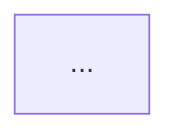

# Mermaid persistence — confirm-then-write flow

The `mermaid` field in every `static_*` response is a ready-to-render Mermaid diagram. Only write it to disk when the user asks to persist/save the graph — never proactively.

## Default path convention

```
docs/debug-graphs/<kind>-<target-slug>.md
```

- `<kind>` — one of `hierarchy`, `callgraph`, `cfg`, `packages`, matching the tool called:

  | Tool | `<kind>` |
  |---|---|
  | `static_class_hierarchy` | `hierarchy` |
  | `static_call_graph` | `callgraph` |
  | `static_cfg` | `cfg` |
  | `static_package_graph` | `packages` |

- `<target-slug>` — a filesystem-safe slug of the target:
  - Class FQN `com.example.login.LoginActivity` → `com-example-login-loginactivity` (lowercase, dots and `/` to `-`).
  - Method `<com.example.Foo: void onClick(android.view.View)>` or `{class, name}` → `<class-slug>-<methodname>` (e.g. `com-example-foo-onclick`).
  - Package `com.example.app.feature.login` → `com-example-app-feature-login`.

Example: a call graph for `com.example.login.LoginViewModel.onLoginClicked` defaults to `docs/debug-graphs/callgraph-com-example-login-loginviewmodel-onloginclicked.md`.

## Flow

1. After Step 6 (showing `ascii`), if the user asks to persist the diagram:
2. Propose the default path (above). If the user names a different path or directory, use theirs instead.
3. Show the `mermaid` content in a fenced ` ```mermaid ` code block, along with the proposed path.
4. Wait for explicit confirmation ("yes", "save it", "looks good", or similar). Don't write on an ambiguous or unrelated reply — ask again or treat as decline.
5. On confirmation, `Write` the file. Wrap the diagram in a fenced ` ```mermaid ` block inside a small Markdown document — include a one-line title (`# <Kind> graph: <target>`) above the fence so the file is self-describing when opened later.
6. Confirm the path written back to the user.

## If the user declines

Don't write anything. The diagram was already shown inline in Step 6 (as `ascii`) — that's sufficient. Don't re-show the `mermaid` block again unless they ask.

## Example written file

```markdown
# Call graph: com.example.login.LoginViewModel.onLoginClicked


```

(The outer fence above is illustrative — the actual file contains one fenced ```mermaid block with the diagram's `mermaid` content verbatim.)
